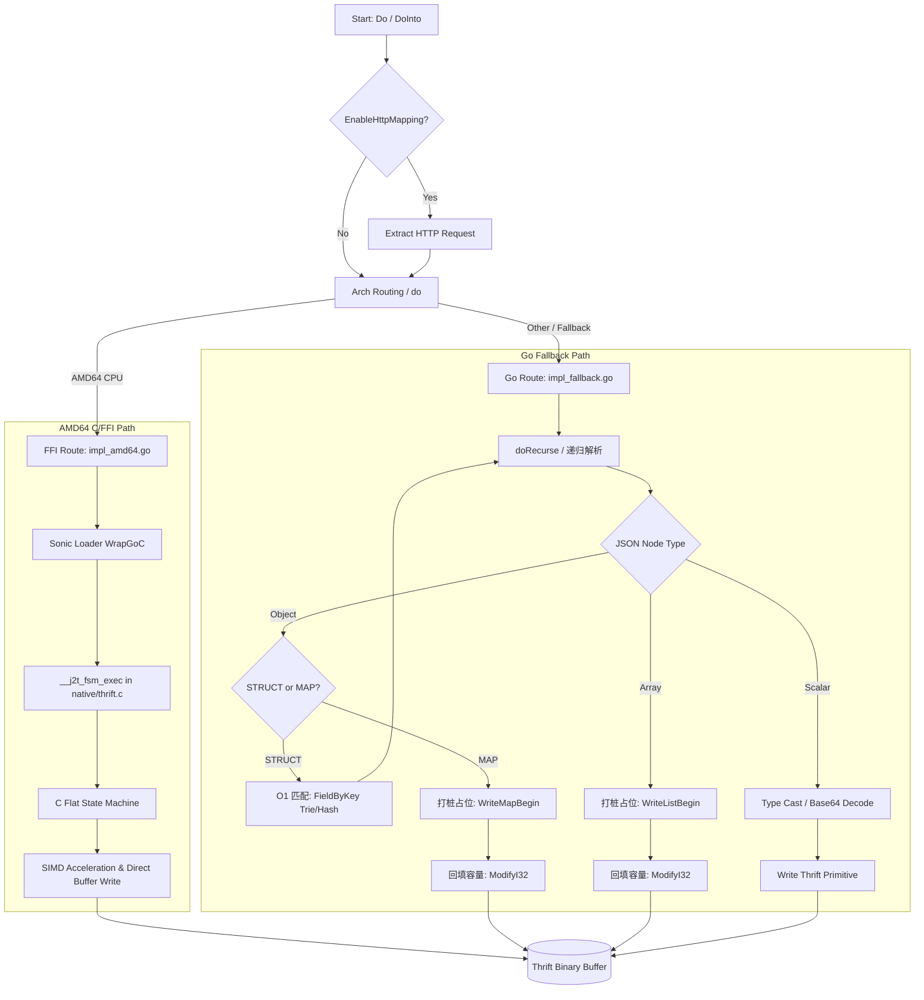

# JSON to Thrift (j2t) Converter

`conv/j2t` 包实现了将 JSON 数据高效转换为 Thrift 二进制数据的核心逻辑。该包充分利用了 SIMD（如 AVX2）、JIT 编译及底层汇编优化以实现极高的序列化性能，同时也提供 Fallback 机制保障跨平台的兼容性。

## 核心设计与数据结构

- **`BinaryConv`**：核心转换器，配置了 `conv.Options` (如 `EnableHttpMapping`, `String2Int64` 等)。对外提供 `Do` 和 `DoInto` 等 API 进行数据转换。
- **配置与 Flags**：将上层 `conv.Options` 中如默认字段输出、未知字段处理等映射为 uint64 的 `types.F_*` 标志位传入底层执行逻辑，以指导 JIT 和原生函数的行为。

## 核心流程流转



1. **入口函数 `Do` / `DoInto`** (在 `conv.go` 中)
   接收 JSON 字节流、目标 Thrift 描述符 (`thrift.TypeDescriptor`) 以及 Context，初始化相关的缓存 `buf` 并提取 HTTP Mapping 对应的 Request。
2. **底层路由 `do`** (平台自适应在 `impl_amd64.go` 或 `impl_fallback.go` 中)
   根据系统架构采用不同的底层实现：
   - **AMD64 下**：触发 FFI 层原生的 C/汇编调用，如果 JSON 数据超过一定长度且类型不是纯标量，还会开启 JSON ASM 验证机制。内部调用底层的 `__cgo_json_to_thrift` 指针进行解析。在解析前完成 JSON 解析器的状态机分配与准备。
   - **Fallback 下** (其他架构如 ARM64)：通过构建自定义状态机 (`_Context`) 在 Go 层逐步递归地解析 JSON，并通过匹配 Thrift 的类型树 (`TypeDescriptor`) 将对应元素编码为 Thrift 二进制并写入结果缓冲。

## HTTP Mapping 处理

在业务网关场景中，往往需要从 HTTP 请求头、Query、Cookie 中获取参数，而非仅从 JSON Body。`j2t` 提供 `HTTP 映射` 功能（通过 `EnableHttpMapping`）：
1. 在 `do` 函数中检测是否需处理 HTTP 参数。如果开启，则解析描述符检查请求需要的必须和可选字段。
2. 通过 `http_conv.go` 提供逻辑，利用 `http.RequestGetter` 从 URL 参数、HTTP Header 和 Cookie 提取数据。
3. 这些数据会被按正确的 Thrift 类型包裹（在 JSON 解析之余）写入最后的数据缓冲中。

## AMD64 & SIMD 优化与 FFI 交互架构

在具有高级指令集（如 AMD64架构下的 AVX/AVX2/SSE）环境时，`dynamicgo` 为追求极致的序列化性能，实现了深度优化的 C 语言扩展，并通过自定义的 FFI（Foreign Function Interface）机制与 Go 层交互：

### 1. C 代码层核心逻辑 (`native/thrift.c`)
- **零分配扁平化状态机 (`j2t_fsm_exec`)**：
  C 层实现了名为 `j2t_fsm_exec` 的核心解析函数。由于 C 的原生递归在深度较大时可能会导致栈溢出，该函数基于自身维护的数据结构 `J2TStateMachine`，使用预分配的数组 (`self->vt`) 模拟堆栈 (`sp`) 的压栈和弹栈。外层通过一个高效的 `while(self->sp)` 循环处理。
- **流式 JSON 解析与底层序列化**：
  函数在循环中通过 `advance_ns` 步进解析 JSON 字符串（跳过空白符等），然后通过 `J2T_ST(st)` 宏（如 `J2T_ARR_0`, `J2T_OBJ_0`, `J2T_VAL` 等）匹配当前 JSON 的结构状态节点。
  在解析出 JSON Key 或 Value 后，立刻基于传入的 `tTypeDesc` (Thrift 类型描述符映射)，在 C 层调用对应的 `tb_write_XXX` 系列函数，直接向预分配的 `GoSlice *buf` 二进制写入 Thrift 的 TType 标记、Field ID、以及对应的值（如 int, string 乃至进行 Base64 转换）。
- **SIMD/位运算加速支持**：
  在遇到复杂的字符串转义（如 `quote`，`unquote`）和数值解析（如 `atof`）等计算密集型节点时，借助于 `native/*.c` 里包装的位运算甚至是 SIMD 指令进行极大加速，显著由于纯 Go 层的解析性能。

### 2. C 与 Go 的 FFI 交互机制 (`internal/native/dispatch_amd64.go`)
- **旁路 Cgo 的高性能跳板 (Sonic Loader)**：
  因为原生的 Cgo 调用有着数十甚至百纳秒级别的上下文切换及协程（G）状态锁定开销，`dynamicgo` 在这里直接弃用了标准的 cgo 方案。
- **纯汇编入口绑定 (`loader.WrapGoC`)**：
  框架在 Go 层导入字节跳动的开源库 `sonic/loader`，它将编译好的不同指令集架构的 C 语言目标文件段（如 `avx2/native.c`）动态加载进 Go 运行时的内存空间并将其链接为 Go 函数。
  ```go
  func J2T_FSM(fsm *types.J2TStateMachine, buf *[]byte, src *string, flag uint64) (ret uint64) {
      return __j2t_fsm_exec(rt.NoEscape(unsafe.Pointer(fsm)), rt.NoEscape(unsafe.Pointer(buf)), rt.NoEscape(unsafe.Pointer(src)), flag)
  }
  ```
  如上所示，当 Go 层通过 `J2T_FSM` 传入配置好的有限状态机 (`fsm`)、JSON 原文 (`src`) 以及目标缓冲 (`buf`) 的指针时，Go 把对应的底层内存以 `NoEscape` 原语直接借给 C 端；C 端执行完毕对缓冲结构体 `GoSlice` 的填充后，Go 层即可零损耗地获得序列化后的 Thrift 二进制流。

## 如何编译 C 代码

C 代码更新或 debug 时候需要重新编译 asm 文件，步骤如下：
1. 安装 clang-14
    ```
    brew install llvm@14
    ```
2. dynamicgo 根目录下下载 `tools/asm2asm` submodule
    ```
    git submodule update --init --remote -f
    ```
3. 执行 `make`，会自动编译生成 `internal/nativx/xxx`（包含 AVX2、AVX、SSE 三个版本的 C 语言目标文件）以及对应的 Go 汇编绑定代码。
4. PS：如果需要在执行 C 时打印 debug log，需要在 makefile 中**编译flags**添加 `-DDEBUG` 定义。
    ```
    CFLAGS_avx		:= -msse -mno-sse4 -mavx -mpclmul -mno-avx2 -mstack-alignment=0 -DDEBUG -DUSE_AVX=1 -DUSE_AVX2=0
    CFLAGS_avx2		:= -msse -mno-sse4 -mavx -mpclmul -mavx2 -mstack-alignment=0 -DDEBUG -DUSE_AVX=1 -DUSE_AVX2=1 
    CFLAGS_sse		:= -msse -mno-sse4 -mno-avx -mno-avx2 -mpclmul -DDEBUG
    ```


## 总结

`conv/j2t` 包通过灵活的双重实现架构（Go层手工递归解包 vs 底层 AVX C/ASM 加速）、与描述符的强绑定以及智能的 HTTP 参数映射，在复杂和高吞吐的微服务网关场景中提供了一套极致性能的 JSON 转 Thrift 的序列化方案。