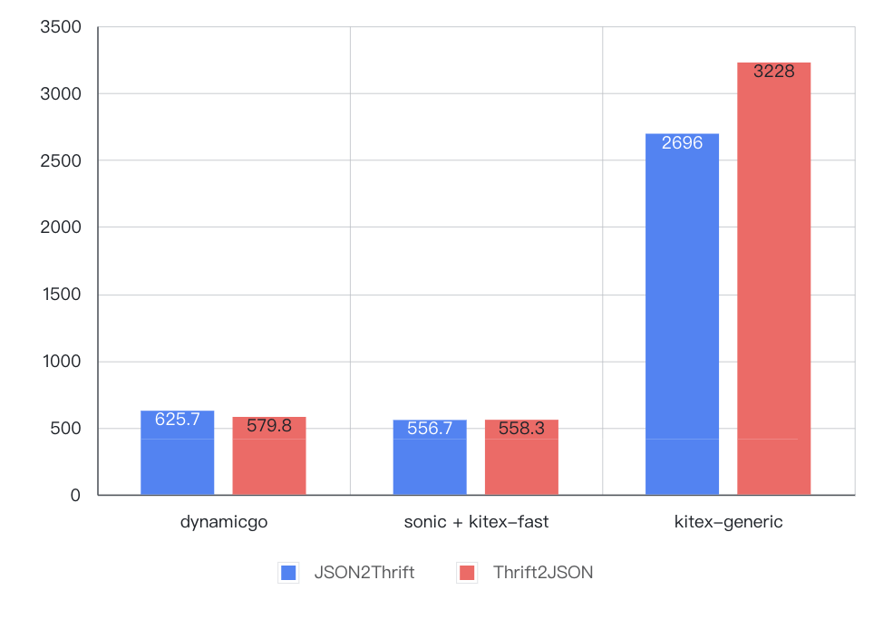
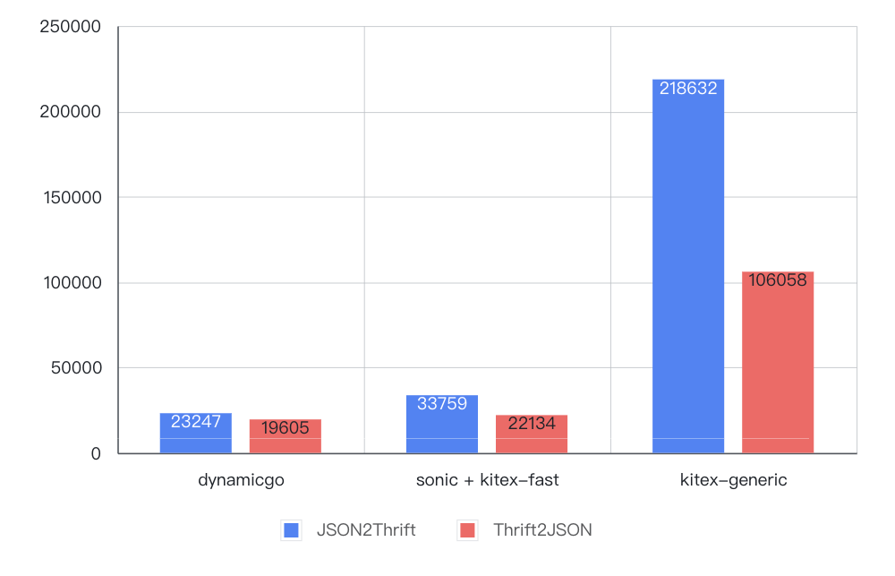

# 背景

当前，thrift 是字节内部主要使用的 RPC 序列化协议，并在 cloudwge 团队充分优化的 kitex RPC 框架基础上，性能相比 JSON 协议有较大优势。但是在和业务团队进行深入合作优化的过程中，我们发现一些特殊业务场景并不能享受代码生成所带来的高性能：

1. 动态反射：动态地 读取、修改、裁剪 数据包中某些字段，如隐私合规场景中字段屏蔽；
2. 数据编排：组合多个子数据包进行 排序、过滤、位移、归并 等操作，如某些 BFF (Backend For Frontent) 服务；
3. 协议转换：作为代理将某种协议的数据转换另一种协议，如 http-rpc 协议转换网关。
4. 泛化调用：需要秒级热更新或迭代非常频繁的 RPC 服务，如大量 kitex 泛化调用（generic-call）用户

不难发现，这些业务场景都具有**难以统一定义静态 IDL**的特点。即使可以通过分布式 sidecar 技术规避这个问题，也往往因为业务需要动态更新而放弃传统代码生成方式，诉诸某些自研或开源的 thrift 泛型编解码库进行泛化 RPC 调用。我们经过性能分析发现，目前这些库相比代码生成方式有巨大的性能下降。以字节某 BFF 服务为例，仅仅 thrift 泛化调用产生的 CPU 开销占比就将近 40%，这几乎是正常 thrift RPC 服务的4到8倍。因此，我们自研了一套能动态处理 RPC 数据（不需要代码生成）同时保证高性能的 Go 基础库 —— dynamicgo。

# 设计与实现

首先要搞清楚当前这些泛化调用库性能为什么差呢？其核心原因是：**采用了某种低效泛型容器来承载中间处理过程中的数据**（典型如 thrift-iterator 中的 map[string]interface{}）。众所周知，Go 的堆内存管理代价是极高的 （GC +heap bitmap），而采用 interface 不可避免会带来大量的内存分配。但实际上相当多的业务场景并不真正需要这些中间表示。比如 http-thrift API 网关中的纯协议转换场景，其本质诉求只是将 JSON 数据依据用户 IDL 转换为 thrift 表示（反之亦然），完全可以基于输入的数据流逐字进行翻译。同样，我们也统计了抖音某 BFF 服务中泛化调用的具体代码，发现真正需要进行读（Get）和写（Set）操作的字段占整个数据包字段不到5%，这种场景下完全可以对不需要的字段进行跳过（Skip）处理而不是反序列化。而 dynamicgo 的核心设计思想是：**基于 原始字节流 和 动态类型描述 原地（in-place） 进行数据处理与转换**。为此，我们针对不同的场景设计了不同的 API 去实现这个目标。

## 动态反射

 对于 thrift 反射代理的使用场景，归纳起来有如下使用需求：

1. 有一套完整结构自描述能力，可表达 scalar 数据类型， 也可表达嵌套结构的映射、序列等关系；
2. 支持增删查改（Get/Set/Index/Delete/Add）与遍历（ForEach）；
3. 保证数据可并发读，但是不需要支持并发写。等价于 map[string]interface{} 或 []interface{}

这里我们参考了 Go reflect 的设计思想，把通过IDL解析得到的准静态类型描述（只需跟随 IDL 更新一次）TypeDescriptor 和 原始数据单元 Node 打包成一个完全自描述的结构——Value，提供一套完整的反射 API。
```go
// IDL 类型描述  
type TypeDescriptor interface {  
    Type()          Type // 数据类型  
    Name()          string // 类型名称  
    Key()           *TypeDescriptor   // for map key  
    Elem()          *TypeDescriptor   // for slice or map element  
    Struct()        *StructDescriptor // for struct  
}  
// 纯TLV数据单元  
type Node struct {  
    t Type // 数据类型  
    v unsafe.Pointer // buffer起始位置  
    l int // 数据单元长度  
}  
// Node + 类型描述descriptor  
type Value struct {  
    Node  
    Desc thrift.TypeDescriptor  
}
```
这样，只要保证 TypeDescriptor 包含的类型信息足够丰富，以及对应的 thrift 原始字节流处理逻辑足够健壮，甚至可以实现 数据裁剪、聚合 等各种复杂的业务场景 。

## 协议转换

协议转换的过程可以通过有限状态机（FSM）来表达。以 JSON->thrift 流程为例，其转换过程大致为：

1. 预加载用户 IDL，转换为运行时的动态类型描述 TypeDescriptor；
2. 从输入字节流中读取一个 json 值，并判断其具体类型（object/array/string/number/bool/null)：
3. 如果是 object 类型，继续读取一个 key，再通过对应的 STRUCT 类型描述找到匹配字段的子类型描述；
4. 如果是 array 类型，递归查找类型描述的子元素类型描述；
5. 其它类型，直接使用当前类型描述。
6. 基于得到的动态类型描述信息，将该值转换为等价的 thrift 字节，写入到输出字节流中 ；
7. 更新输入和输出字节流位置，跳回2进行循环处理，直到输入终止（EOF）。


<center>图1 JSON2Thrift 数据转换流程</center>

整个过程可以完全做到 in-place 进行，并且结合 内存池化 技术，仅需为输出字节流分配一次内存即可。

## 数据编排

与前面两个场景稍微有所不同，数据编排场景下可能涉及 数据位置的改变（异构转换），并且往往会 访问大量数据节点（最坏复杂度O(N) )。在与抖音隐私合规团队的合作研发中我们就发现了类似问题。它们的一个重要业务场景：要横向遍历某一个 array 的子节点，查找是否有违规数据并进行整行擦除。这种场景下，直接基于原始字节流进行查找和插入可能会带来大量重复的 skip 定位、数据拷贝开销，最终导致性能劣化。因此我们需要一种高效的反序列化（带有指针）结构表示来处理数据。根据以往经验，我们想到了 DOM （Document Object Model），这种结构被广泛运用在 JSON 的泛型解析场景中（如 rappidJSON、sonic/ast），并且性能相比 map+interface 泛型要好很多。

要用 DOM 来描述一个 thrift 结构体，首先需要一个能准确描述数据节点之间的关系的定位方式 —— Path。其类型应该包括 list index、map key 以及 struct field id等。
```go
type PathType uint8   
  
const (  
    PathFieldId PathType = 1 + iota // STRUCT下字段ID  
    PathFieldName // STRUCT下字段名称  
    PathIndex // SET/LIST下的序列号  
    PathKey // MAP下的string key  
    PathObjKey// MAP下的object key  
)  
  
type PathNode struct {  
    Path            // 相对父节点路径  
    Node            // 原始数据单元  
    Next []PathNode // 存储子节点  
 }
```
在 Path 的基础上，我们组合对应的数据单元 Node，然后再通过一个 Next 数组动态存储子节点，便可以组装成一个类似于 BTree 的泛型结构。


<center>图2 thrift DOM 数据结构</center>

这种泛型结构比 map+interface 要好在哪呢？首先，底层的数据单元 Node 都是对原始 thrift data 的引用，没有转换 interface 带来的二进制编解码开销；其次，我们的设计保证所有树节点 PathNode 的内存结构是完全一样，并且由于父子关系的底层核心容器是 slice， 我们又可以更进一步采用内存池技术，将整个 DOM 树的子节点内存分配与释放都进行池化从而避免调用 go 堆内存管理。测试结果表明，在理想场景下（后续反序列化的DOM树节点数量小于等于之前反序列化节点数量的最大值——这由于内存池本身的缓冲效应基本可以保证），内存分配次数可为0，性能提升200%！（见【性能测试-全量序列化/反序列化】部分）。

# 性能测试

这里我们分别定义 [简单](testdata/idl/baseline.thrift#L3)（Small)、[复杂](testdata/idl/baseline.thrift#L18)（Medium) 两个基准结构体分别在比较 不同数据量级 下的性能，同时添加 [简单部分](testdata/idl/baseline.thrift#L12)（SmallPartial）、[复杂部分](testdata/idl/baseline.thrift#L36)（MediumPartial） 两个对应子集，用于【反射-裁剪】场景的性能比较：

- Small：114B，6个有效字段
- SmallPartial：small 的子集，55B，3个有效字段
- Medium: 6455B，284个有效字段
- MediumPartial: medium 的子集，1922B，132个有效字段

其次，我们依据上述业务场景划分为 反射、协议转换、全量序列化/反序列化 三套 API，并以代码生成库[ kitex/FastAPI](https://github.com/cloudwego/kitex/blob/aed28371eb88b2668854759ce9f4666595ebc8de/pkg/remote/codec/thrift/thrift.go)、泛化调用库 [kitex/generic](https://github.com/cloudwego/kitex/tree/develop/pkg/generic)、JSON 库 [sonic](https://github.com/bytedance/sonic) 为基准进行性能测试。其它测试环境均保持一致：

- Go 1.18.1
- CPU intel i9-9880H 2.3GHZ
- OS macOS Monterey 12.6

## 反射

### 代码

dynamicgo/testdata/baseline_tg_test.go

### 用例

- GetOne：查找字节流中最后1个数据字段
- GetMany：查找前中后5个数据字段
- MarshalMany：将GetMany中的结果进行二次序列化
- SetOne：设置最后一个数据字段
- SetMany：设置前中后3个节点数据
- MarshalTo：将大 thrift 数据包裁剪为小 thrift 数据包 （Small -> SmallPartial 或 Medium -> MediumParital）
- UnmarshalAll+MarshalPartial：代码生成/泛化调用方式裁剪——先反序列化全量数据再序列化部分数据。效果等同于MarshalTo。

### 结果

- 简单（ns/OP）

 

- 复杂（ns/OP）


### 结论

- dynamicgo 一次查找+写入 开销大约为代码生成方式的 2 ~ 1/3、为泛化调用方式的 1/12 ~ 1/15，并随着数据量级增大优势加大；
- dynamicgo thrift裁剪 开销接近于代码生成方式、约为泛化调用方式的 1/10～1/6，并且随着数据量级增大优势减弱。

## 协议转换

### 代码

- JSON2Thrift: dynamicgo/testdata/baseline_j2t_test.go
- ThriftToJSON: dynamicgo/testdata/baseline_t2j_test.go

### 用例

- JSON2thrift：JSON 数据转换为等价结构的 thrift 数据
- thrift2JSON：将 thrift 数据转换为等价结构的 JSON 数据
- sonic + kitex-fast：表示通过 sonic 处理 json 数据（有结构体），通过 kitex 代码生成处理 thrift 数据

### 结果

- 简单（ns/OP）

 

- 复杂（ns/OP）



### 结论

- dynamicgo 协议转换开销约为代码生成方式的 1～2/3、泛化调用方式的 1/4～1/9，并且随着数据量级增大优势加大；

## 全量序列化/反序列化

### 代码

dynamicgo/testdata/baseline_tg_test.go

### 用例

- UnmarshalAll：反序列化所有字段。其中对于 dynamicgo 有两种模式：
- new：每次重新分配 DOM 内存；
- reuse：使用内存池复用 DOM 内存。
- MarshalAll：序列化所有字段。

### 结果

- 简单（ns/OP）


- 复杂（ns/OP）


### 结论

- dynamicgo 全量序列化 开销约为代码生成方式的 6～3倍、泛化调用方式的 1/4～1/2，并且随着数据量级增大优势减弱；
- Dynamigo 全量反序列化+内存复用 场景下开销约为代码生成方式的 1.8～0.7、泛化调用方式的 1/13～1/8，并且随着数据量级增大优势加大。

# 应用与展望

当前，dynamicgo 已经应用到许多重要业务场景中，包括：

1. 抖音 隐私合规 中间件（thrift 反射）；
2. 抖音某 BFF 服务下游数据按需下发（thrift 裁剪）；
3. 字节跳动某 API 网关协议转换（JSON<>thrift 协议转换）。

并且逐步上线并取得收益。目前 dynamic 还在迭代中，接下来的工作包括：

1. 集成到 Kitex 泛化调用模块中，为更多用户提供高性能的 thrift 泛化调用模块；
2. Thrift DOM 接入 DSL（GraphQL）组件，进一步提升 BFF 动态网关性能；
3. 支持 Protobuf 协议。

也欢迎感兴趣的个人或团队参与进来，共同开发！

