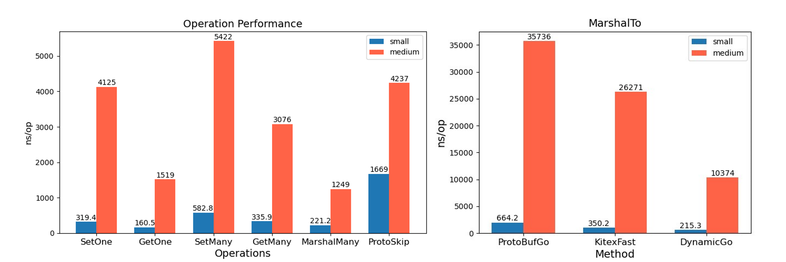
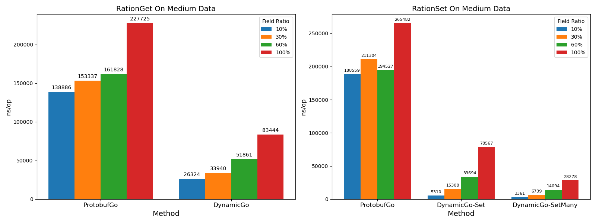
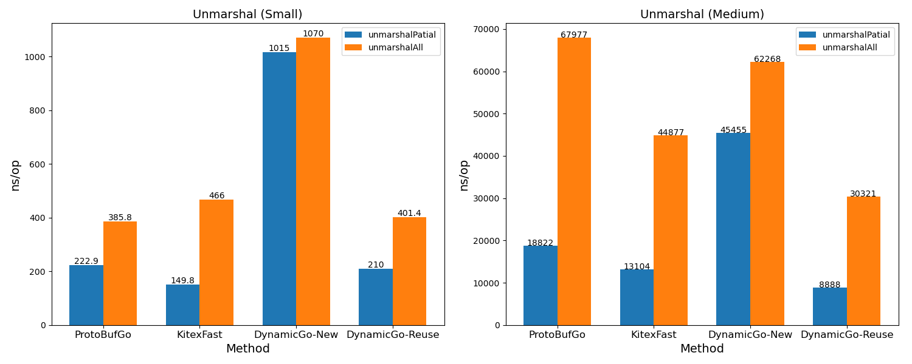
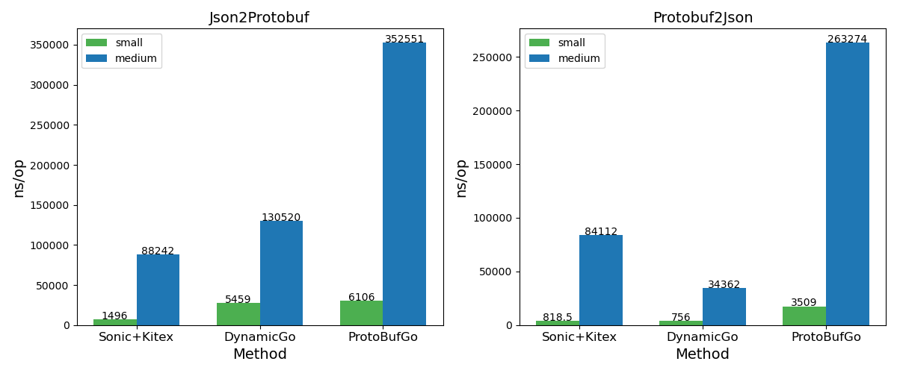

# DynamicGo For Protobuf Protocol
该模块实现了dynamicgo对于高性能protobuf协议泛化调用的支持，由于protobuf协议与thrift协议的编码格式和规范存在较大差异，这里我们将详细介绍dynamicgo对于protobuf协议的相关设计细节和[飞书设计文档](https://zt69na939u.feishu.cn/docx/EzzZdEFDDofpFtxjFVFcMjQgnNd)

## protobuf协议重要细节
在介绍链路设计之前我们有必要先了解一下protobuf协议的规范，后续的各项设计都将在严格遵守该协议的规范的基础上进行改进。

## Protobuf源码链路
Protobuf源码链路过程主要涉及三类数据类型之间的转换，以Message对象进行管理，自定义Value类实现反射和底层存储，用Message对象能有效地进行管理和迁移，但也带来了许多反射和序列化开销。


### Protobuf编码格式
protobuf编码字段格式大体上遵循TLV(Tag，Length，Value)的结构，但针对具体的类型存在一些编码差异，这里我们将较为全面的给出常见类型的编码模式。

#### Message Field
protobuf的接口必定包裹在一个Message类型下，因此无论是request还是response最终都会包裹成一个Message对象，那么Field则是Message的一个基本单元，任何类型的字段都遵循这样的TLV结构：

- Tag由字段编号Field_number和wiretype两部分决定，对位运算后的结果进行varint压缩，得到压缩后的字节数组作为字段的Tag。
- wiretype的值则表示的是value部分的编码方式，可以帮助我们清楚如何对value的读取和写入。**到目前为止，wiretype只有VarintType，Fixed32Type，Fixed64Type，BytesType四类编码方式。** 
  - 其中属于VarintType类型的value会被压缩后再编码。
  - 属于Fixed32Type和Fixed64Typ固定长度类型的value分布占用4字节和8字节。
  - 属于不定长编码类型BytesType的则会编码计算value部分的ByteLen再拼接value。
- ByteLen用于编码表示value部分所占的字节长度，同样我们的bytelen的值也是经过varint压缩后得到的，但bytelen并不是每个字段都会带有，只有不定长编码类型BytesType才会编码bytelen。**ByteLen由于其不定长特性，计算过程在序列化过程中是需要先预先分配空间，记录位置，等写完内部字段以后再回过头来填充。**
- Value部分是根据wiretype进行对应的编码，字段的value可能存在嵌套的T(L)V结构，如字段是Message，Map等情况。
#### Message
关于Message本身的编码是与上面提到的字段编码一致的，也就是说遇到一个Message字段时，我们会先编码Message字段本身的Tag和bytelen，然后再来逐个编码Message里面的每个字段的TLV。**但需要提醒注意的是，在最外层不存在包裹整个Message的Tag和bytelen前缀，只有每个字段的TLV拼接。**

#### List
list字段比较特殊，protobuf为了节省存储空间，根据list元素的类型分别采用不同的编码模式。
- Packed List Mode  
如果list的元素value本身属于VarintType/Fixed32Type/Fixed64Type编码格式，那么将采用packed模式编码整个List，在这种模式下的list是有bytelen的。protobuf3默认对这些类型的list启用packed。

- UnPacked List Mode  
**当list元素属于BytesType编码格式时**，list将使用unpacked模式，直接编码每一个元素的TLV，这里的V可能是嵌套的如List<Message>模式，**那么unpacked模式下所有元素的tag都是相同的，list字段的结束标志为与下一个TLV字段编码不同或者到达buf末尾。**


#### Map
Map编码模式与unpacked list相同，根据官方文档所说，Map的每个KV键值对其实本质上就是一个Message，固定key的Field_number是1，value的Field_number是2，那么Map的编码模式就和`List<Message>`一致了。


### Descriptor细节
这里主要介绍一下源码的descriptor设计上的一些需要注意的细节，有助于理解我们自定义descriptor的方案。
- Service接口由ServiceDescriptor来描述，ServiceDescriptor当中可以拿到每个rpc函数的MethodDescriptor。
- MethodDescriptor中Input()和output()两个函数返回值均为MessageDescriptor分别表示request和response。
- MessageDescriptor专门用来描述一个Message对象（也可能是一个MapEntry），可以通过Fields()找到每个字段的FieldDescriptor。
- FieldDescriptor兼容所有类型的描述。


**FieldDescriptor注意要点：**
1. 如果字段是一个List，那么FieldDescriptor中Kind()表示的是元素的Kind()，字段是否是List只能通过IsList()函数区分，即当字段为List<Message>的情况，那么此时调用Kind()得到的为messagekind。
2. 如果字段是Map，那么FieldDescriptor中Kind()表示为messageKind，字段是否是List只能通过IsMap()函数区分。
3. 当字段为messagekind时（可能的情况message，List<Message>，map<int/string，Message>），可以通过Message()方法，可以获得下层嵌套的MessageDescriptor。
4. MapKey的FieldDescriptor被限定为uint/bool/int/string类型。目前的代码设计上将uint32，uint64，int32，int64全都转成了int，bool没处理。

## Descriptor自定义设计
Descriptor的设计原理基本与源码一致，不过为了兼容性和避免强转，这里我们通thrift抽象了一个TypeDescriptor来处理类型问题，但因为protobuf编码格式的问题，TypeDescriptor做了一部分修改。

parse过程主要利用的是[`github.com/jhump/protoreflect@v1.8.2`](https://pkg.go.dev/github.com/jhump/protoreflect@v1.8.2)解析得到的第三方descriptor进行的再封装，从实现过程上来看，与高版本protoreflect利用[`protocompile`](https://pkg.go.dev/github.com/bufbuild/protocompile)对原始链路再make出源码的warp版本一致，更好的实现或许是处理利用protoreflect中的ast语法树构造。

### TypeDescriptor
```go
type TypeDescriptor struct {
	baseId FieldNumber // for LIST/MAP to write field tag by baseId
	typ    Type
	name   string
	key    *TypeDescriptor
	elem   *TypeDescriptor
	msg    *MessageDescriptor // for message, list+message element and map key-value entry
}
```

- `baseId`：因为对于LIST/MAP类型的编码特殊性，如在unpack模式下，每一个元素都需要编写Tag，我们必须在构造时针对LIST/MAP提供fieldnumber，来保证读取和写入的自反射性。
- `msg`：这里的msg不是仅Message类型独有，主要是方便J2P部分对于List<Message>和marshalto中map获取可能存在value内部字段缺失的MapEntry的MassageDescriptor（在源码的设计理念当中MAP的元素被认为是一个含有key和value两个字段的message）的时候能利用TypeDescriptor进入下一层嵌套。具体位置：[j2p for List<Message>](../conv/j2p/decode.go#L422)和[map entry marshalto](./generic/value.go#L853)。
- `typ`：这里的Type不同于源码的FieldDescriptor，对LIST/MAP做了单独定义，对应`type.go`文件下的[`Type`](./type.go#L87)。

### FieldDescriptor
```go
type FieldDescriptor struct {
	kind     ProtoKind // the same value with protobuf descriptor
	id       FieldNumber
	name     string
	jsonName string
	typ      *TypeDescriptor
}
```

- FieldDescriptor的设置是希望变量和函数作用与源码FieldDescriptor基本一致，只是增加`*TypeDescriptor`可以更细粒度的反应类型以及对FieldDescriptor的API实现。
- `kind`：保留kind，对应`type.go`文件下的[`ProtoKind`](./type.go#L41)，LIST情况下，kind是列表元素的kind类型，MAP和MESSAGE情况下，messagekind。

## ProtoBuf DOM设计
显然protobuf的层层包裹设计与thrift差异很大，这也给DOM设计造成了许多的困难，虽然思想上和dynamicgo-thrift一致，但为了更统一化的处理节点和片段管理，这里我们对链路的存储格式和函数设计做了一些改进。
### 存储结构
#### Node结构
```go
type Node struct {
    t    proto.Type
    et   proto.Type
    kt   proto.Type
    v    unsafe.Pointer
    l    int // ptr len
    size int // only for MAP/LIST element counts
}
```

**具体的存储规则如下：**
- 基本类型Node表示：指针v的起始位置不包含tag，指向(L)V，t = 具体类型，et，kt = UNKNOWN
- Message类型Node：指针v的起始位置不包含tag，指向(L)V，如果是root节点，那么v的起始位置本身没有前缀的L，直接指向了V即第一个字段的tag上，而其余子结构体都包含前缀L。
  - t = MESSAGE，et，kt = UNKNOWN
- List类型Node：为了兼容List的两种模式和自反射的完整性，我们必须包含list的完整片段和tag。**因此List类型的节点，v指向list的tag上，即如果是packed模式就是list的tag上，如果是unpacked则在第一个元素的tag上。** 
  - t = LIST，et = 元素类型，kt = UNKNOWN，size = 元素个数。
- Map类型Node：同理，Map的指针v也指向了第一个pair的tag位置。
  - t = MAP ，kt = Key类型 et = Value类型，size = 元素个数。
- UNKNOWN类型Node：无法解析的合理字段Node会将TLV完整存储，多个相同字段Id的会存到同一节点，缺点是内部的子节点无法构建，同官方源码unknownFields原理一致。
- ERROR类型Node：基本与thrift一致，在setnotfound中，若片段设计与上述规则一致则可正确构造插入。
- 虽然MAP/LIST的父级Node存储有些变化，但是其子元素节点都是基本类型/MESSAGE，所以**DOM当中的所有叶子节点存储格式还是基本的(L)V。**

#### Value结构
value的结构本身是对Node的封装，将Node与相应的descriptor封装起来，但不同于thrift，在protobuf当中由于片段无法完全自解析出具体类型，之后的涉及到具体编码的部分操作不能脱离descriptor，只能实现Value类作为调用单位。

```go
type Value struct {
    Node
    Desc    *proto.TypeDescriptor
    IsRoot  bool
}

func NewRootValue(desc *proto.TypeDescriptor, src []byte) Value {
    return Value{
        Node:     NewNode(proto.MESSAGE, src),
        Desc: desc,
        IsRoot: true,
    }
}

// only for basic Node
func NewValue(desc *proto.TypeDescriptor, src []byte) Value {
    return Value{
        Node: NewNode(desc.Type(), src),
        Desc: desc,
    }
}
```
由于从rpc接口解析后我们直接得到了对应的TypeDescriptor，再加上root节点本身没有前缀TL的独特编码结构，我们设计`IsRoot`来区分root节点和其余节点，也能避免利用父类强转。

#### Path与PathNode
结构功能均与thrift一致，且protobuf不存在PathBinKey。
```go
// Path represents the relative position of a sub node in a complex parent node
type Path struct {
    t PathType // 类似div标签的类型，用来区分field，map，list元素，帮助判定父级嵌套属于什么类型结构
    
    v unsafe.Pointer // PathStrKey， PathFieldName类型，存储的是Key/FieldName的字符串指针
    
    l int 
    // PathIndex类型，表示LIST的下标
    // PathIntKey类型，表示MAPKey的数值
    // PathFieldId类型，表示字段的id
}

pathes []Path : 合理正确的Path数组，可以定位到嵌套复杂类型里具体的key/index的位置
```
### 构建DOM Tree
#### PathNode.Load/Value.Children
构建DOM支持懒加载和全加载即recurse参数。
- 在懒加载模式下LIST/MAP的Node当中size不会同步计算，因为字段会直接skip，而全加载在构造叶子节点的同时顺便更新了size，但不影响后续的迭代器反射，后续迭代器翻译还是以Node片段长度为准，而不是直接看size。
- LIST/MAP的节点包含tag，代码中hindlechild函数会传入一个tagL参数，遇到LIST/MAP时取地址片段时会让start前移tag长度。
查找字段

### 查找字段
#### GetByPath/GetByPathWithAddress/GetMany
支持任意Node查找，查找函数设计了三个外部API：GetByPath，GetByPathWithAddress，GetMany。
- GetByPath函数：返回查找出来的Value，查找失败返回ERRORNode
- GetByPathWithAddress：返回Value和当前调用节点到查找节点过程中每个Path嵌套层的tag位置的偏移量。[]address与[]Path个数对应，若调用节点为root节点，那么都是到buf首地址的偏移量。、
- GetMany：传入当前嵌套层下合理的[]PathNode的Path部分，直接返回构造出来多个Node，得到完整的[]PathNode，可继续用于MarshalMany

#### 设计思路
查找过程是根据传入的[]Path来循环遍历查找每一层Path嵌套里面对应的位置，根据嵌套的Path类型（fieldId，mapKey，listIndex），调用不同的search函数。
- searchFieldId：找到字段，返回字段tag位置，未找到则返回message片段末尾。
- searchInt/strKey：找到字段，返回字段tag位置，未找到则返回map片段末尾。
- searchIndex：找到字段，若为pack则返回value起始位置，若为unpack返回元素tag位置，未找到则返回list片段末尾。
构造最终返回的Node时，根据具体类型看是否需要去除tag即可，返回的[]address刚好在search过程中完成了append每一层Path的tag偏移量。

### 插入字段
#### SetByPath/setMany
两个外部API：SetByPath和SetMany。插入字段思路大体与thrift一致，**区别在于：为了保证兼容pack/unpack/map/message的统一性，不同于thrift，对于新增数据只能采用尾插法，完成插入操作后需要进行回写嵌套层bytelen的操作。**
- SetByPath：只支持root节点调用，保证UpdateByLen更新的完整和正确性。
- setMany：可支持局部节点插入，除了构造当前嵌套层下合理的PathNode，还需要额外传入rootValue的指针，目标插入节点到root节点的位置，以及到root的[]Path，完成多个节点插入后。判断当前调用节点是否为root，若不是则完成当前层的updatebytelen后，需要利用rootValue再调用一次updatebytelen。

#### Updatebytelen细节
- 计算插入完成后新的长度与原长度的差值，存下当前片段增加或者减少的diffLen。
- 从里向外逐步更新[]Path数组中存在bytelen的嵌套层（只有packed list和message）的bytelen字节数组。
- 更新规则：先readTag，然后再readLength，得到解varint压缩后的具体bytelen数值，计算newlen = bytelen + diffLen，计算newbytelen压缩后的字节长度与原bytelen长度的差值sublen，并累计diffLen+=sublen。
- 指针向前移动到下一个path和address。


### 删除字段
#### UnsetByPath
目前只支持root节点调用。删除字段同插入字段，即找到对应的片段后直接将片段置空，然后更新updatebytelen。

### PathNode序列化
对外API：Marshal和MarshalTo。
#### Marshal
DOM建好PathNode后，可直接调用PathNode的Marshal方法即可，本质是BFS遍历拼接DOM的所有叶子节点，Tag部分会通过Path类型和Node类型进行补全，bytelen会预先分配，根据实际遍历节点进行回写，特殊处理root层，不需要写message的TL前缀。


#### MarshalTo
MarshalTo主要用于裁剪字段，获取新旧descriptor中共有的字段id，然后进行翻译，可支持多层嵌套内部的字段缺失，LIST/MAP内部元素字段缺失，核心关键在于`message`，`List<Message>`，`map<int/string，Message>`的descriptor均为messageKind。

## JSON协议转换
### ProtoBuf——>JSON
#### 协议转换过程
协议转换的过程可以理解为逐字节解析 ProtoBuf，并结合 Descriptor 类型编码为 JSON 到输出字节流，整个过程是 in-place 进行的，并且结合内存池技术，仅需为输出字节流分配一次内存即可。
ProtoBuf——>JSON 的转换过程如下：
1. 根据输入的 Descriptor 指针类型区分，若为 Singular(string/number/bool/Enum) 类型，跳转到
2. 按照 Message（[Tag] [Length] [TLV][TLV][TLV]....）编码格式对输入字节流执行 varint解码，将Tag解析为 fieldId（字段ID）、wireType（字段wiretype类型）；
3. 根据第2步解析的 fieldId 确定字段 FieldDescriptor，并编码字段名 key 作为 jsonKey 到输出字节流；
4. 根据 FieldDescriptor 确定字段类型（Singular/Message/List/Map），选择不同编码方法编码 jsonValue 到输出字节流；
5. 如果是 Singular 类型，直接编码到输出字节流；
6. 其它类型递归处理内部元素，确定子元素 Singular 类型进行编码，写入输出字节流中；
7. 及时输入字节流读取位置和输出字节流写入位置，跳回2循环处理，直到读完输入字节流。

#### List类型处理
> List类型包括 PackedList、UnpackedList，区别为元数据类型是否为 Number。在转换时根据 FieldDescriptor 区分这两种类型；
- PackedList：[Tag][Length][Value Value Value Value ....]
     解析完 Tag、Length后循环处理 Value数组，每解析一个 Value元素，编码到输出字节流；
- UnpackedList：[Tag][Length][Value] [Tag][Length][Value] ... 
  所有子节点共享 fieldId（字段ID），因此每次预解析 Tag 得到 elementNumber，并以 (elementNumber==fieldId)=true 作为循环条件直到结束。

#### Map类型处理
Map：[PairTag][PairLength][KeyTag][KeyLength][KeyValue][ValueTag][ValueLength][ValueValue]....

Map 类型所有 PairTag 共享相同 fieldId（字段ID）。因此预解析 PairTag 得到 pairNumber，并以 (pairNumber==fieldId)=true 作为循环条件直到结束。

### JSON——>ProtoBuf
协议转换过程中通过 [sonic](https://github.com/bytedance/sonic) 框架实现 in-place 遍历 JSON，并实现了接口 Onxxx（OnBool、OnString、OnInt64....）方法达到编码 ProtoBuf 的目标，编码过程也做到了 in-place。

#### VisitorUserNode 结构
因为在编码 Protobuf 格式的 Mesage/UnpackedList/Map 类型时需要对字段总长度回写，并且在解析复杂类型（Message/Map/List）的子元素时需要依赖复杂类型 Descriptor 来获取子元素 Descriptor，所以需要 VisitorUserNode 结构来保存解析 json 时的中间数据。

```go
type VisitorUserNode struct {
    stk             []VisitorUserNodeStack
    sp              uint8
    p               *binary.BinaryProtocol
    globalFieldDesc *proto.FieldDescriptor
}
```
1. stk：记录解析时中间变量的栈结构，在解析 Message 类型时记录 MessageDescriptor、PrefixLen；在解析 Map 类型时记录 FieldDescriptor、PairPrefixLen；在解析 List 类型时记录 FieldDescriptor、PrefixListLen；
2. sp：当前所处栈的层级；
3. p：输出字节流；
4. globalFieldDesc：每当解析完 MessageField 的 jsonKey 值，保存该字段 Descriptor 值；

#### VisitorUserNodeStack 结构
记录解析时字段 Descriptor、回写长度的起始地址 PrefixLenPos 的栈结构
```go
type VisitorUserNodeStack struct {
    typ   uint8
    state visitorUserNodeState
}
```
1. typ：当前字段的类型，取值有对象类型（objStkType）、数组类型（arrStkType）、哈希类型（mapStkType）；
2. state：存储详细的数据值；

#### visitorUserNodeState 结构
```go
type visitorUserNodeState struct {
    msgDesc   *proto.MessageDescriptor
    fieldDesc *proto.FieldDescriptor
    lenPos    int
}
```
1. msgDesc：记录 root 层的动态类型描述 MessageDescriptor；
2. fieldDesc：记录父级元素（Message/Map/List）的动态类型描述 FieldDescriptor；
3. lenPos：记录需要回写 PrefixLen 的位置；

#### 协议转换过程
JSON——>ProtoBuf 的转换过程如下：
1. 从输入字节流中读取一个 json 值，并判断其具体类型（object/array/string/float/int/bool/null）；
2. 如果是 object 类型，可能对应 ProtoBuf MapType/MessageType，sonic 会按照 `OnObjectBegin()——>OnObjectKey()——>decodeValue()...` 顺序处理输入字节流。
      - OnObjectBegin()阶段解析具体的动态类型描述 FieldDescriptor 并压栈；
      - OnObjectKey() 阶段解析 jsonKey 并以 ProtoBuf 格式编码 Tag、Length 到输出字节流；
      - decodeValue()阶段递归解析子元素并以 ProtoBuf 格式编码 Value 部分到输出字节流，若子类型为复杂类型（Message/Map），会递归执行第 2 步；若子类型为复杂类型（List），会递归执行第 3 步。
3. 如果是 array 类型，对应 ProtoBuf PackedList/UnpackedList，sonic 会按照 `OnObjectBegin()——>OnObjectKey()——>OnArrayBegin()——>decodeValue()——>OnArrayEnd()...` 顺序处理输入字节流。
     - `OnObjectBegin()`阶段处理解析 List 字段对应动态类型描述 FieldDescriptor 并压栈；
     - `OnObjectKey()`阶段解析 List 下子元素的动态类型描述 FieldDescriptor 并压栈；
     - `OnArrayBegin()`阶段将 PackedList 类型的 Tag、Length 编码到输出字节流；
     - `decodeValue()`阶段循环处理子元素，按照子元素类型编码到输出流，若子元素为复杂类型（Message），会跳转到第 2 步递归执行。
4. 在结束处理某字段数据后执行 `onValueEnd()、OnArrayEnd()、OnObjectEnd()`，获取栈顶 lenPos 数据，对字段长度部分回写并退栈。
5. 更新输入和输出字节流位置，跳回第 1 步循环处理，直到处理完输入流数据。

## 性能测试
构造与thrift性能测试基本相同的[baseline.proto](../testdata/idl/baseline.proto)文件，定义了对应的简单（[Small](../testdata/idl/baseline.proto#L7)）、复杂（[Medium](../testdata/idl/baseline.proto#L22)）、简单缺失（[SmallPartial](../testdata/idl/baseline.proto#L16)）、复杂缺失（[MediumPartial](../testdata/idl/baseline.proto#L40)） 两个对应子集，并用kitex命令生成了对应的[baseline.pb.go](../testdata/kitex_gen/pb/baseline/baseline.pb.go)。
主要与Protobuf-Go官方源码进行比较，部分测试与kitex-fast也进行了比较，测试环境如下：
- OS：Windows 11 Pro Version 23H2
- GOARCH: amd64
- CPU: 11th Gen Intel(R) Core(TM) i5-1135G7 @ 2.40GHz
- Go VERSION：1.20.5

### 反射
- 代码：[dynamicgo/testdata/baseline_pg_test.go](../testdata/baseline_pg_test.go)
- 图中列举了DOM常用操作的性能，测试细节与thrift相同。
- MarshalTo方法：相比protobufGo提升随着数据规模的增大趋势越明显，ns/op开销约为源码方法的0.29 ~ 0.32。
  


### 字段Get/Set定量测试
- 代码：[dynamicgo/testdata/baseline_pg_test.go#BenchmarkRationGet_DynamicGo](../testdata/baseline_pg_test.go#L1607)
- [factor](../testdata/baseline_pg_test.go#L1563)用于修改从上到下扫描proto文件字段获取比率。
- 定量测试比较方法是protobufGo的dynamicpb模块和DynamicGo的Get/SetByPath，SetMany，测试对象是medium data的情况。
- Set/Get字段定量测试结果均优于ProtobufGo，且在获取字段越稀疏的情况下性能加速越明显，因为protobuf源码不论获取多少比率的字段，都需要完整序列化全体对象，而dynamicgo则是直接解析buf完成copy。
- setmany性能加速更明显，在100%字段下ns/op开销约为0.11。



### 序列化/反序列化
- 代码：[dynamicgo/testdata/baseline_pg_test.go#BenchmarkProtoMarshalAll_DynamicGo](../testdata/baseline_pg_test.go#L1212)
- 序列化在small规模略高于protobufGo，medium规模的数据上性能优势更明显，ns/op开销约为源码的0.54 ~ 0.84。
- 反序列化在reuse模式下，small规模略高于protobufGo，在medium规模数据上性能优势更明显，ns/op开销约为源码的0.44 ~ 0.47，随数据规模增大性能优势增加。



### 协议转换
- Json2Protobuf优于ProtobufGo，ns/op性能开销约为源码的0.21 ~ 0.89，随着数据量规模增大优势增加。
- 代码：[dynamicgo/testdata/baseline_j2p_test.go](../testdata/baseline_j2p_test.go)
- Protobuf2Json性能明显优于ProtobufGo，ns/op开销约为源码的0.13 ~ 0.21，而相比Kitex，ns/op约为Sonic+Kitex的0.40 ~ 0.92，随着数据量规模增大优势增加。
- 代码：[dynamicgo/testdata/baseline_p2j_test.go](../testdata/baseline_p2j_test.go)
  


详细数据结果文件可在飞书文档中下载。

## TODO
- [ ] 添加JSON协议的HttpMapping。
- [ ] 修改为TypeDescriptor后，J2P由于sonic限定接口`Onxxx`，为了write tag，暂时还是只能用fielddescriptor，兼容其他类型的建议不放到snoic当中，而是走其他分支直接用binaryprotocol写入比较好。
- [ ] 部分JSON option暂未实现。
- [ ] DOM tree的Assign函数还需要实现，尝试实现但存在一些问题由于时间关系不太好解决。
- [ ] 序列化/反序列化在small数据规模下的开销进一步优化。
- [ ] 是否可以优化到不区分DOM的Node不区分root层和其他层的Message？目前的root层MESSAGE的Node不带L，而其他的都带有L，感觉可以优化之前设计没做好可能，如果统一可能有别的地方会带来些小问题，比如在非递归的DOM下marshal则需要自己补充L，因为Path只补齐了Tag。
- [ ] 用Kind的地方设计如何方便地完全被TypeDescriptor替代。
- [ ] DOM对于Enum，Oneof，Extension（Extension已经在protobuf3官方弃用）的支持。
- [ ] DOM相关的部分option有待实现。
